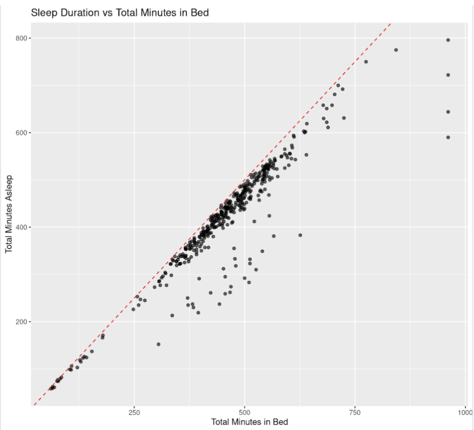
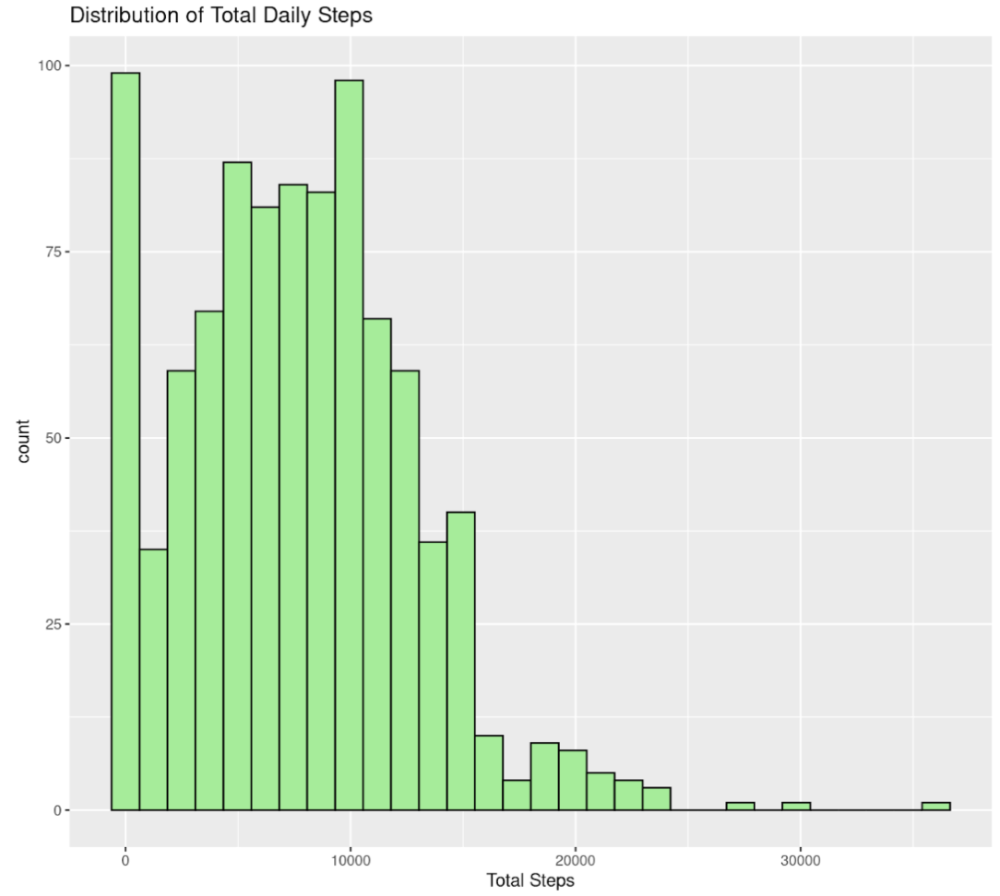
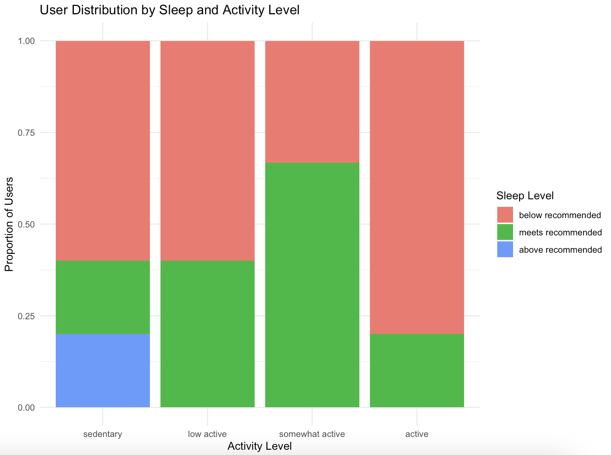

# Bellabeat Case Study: End-to-End Data Analysis in R

This is the final capstone project for the Google Data Analytics Professional Certificate. The goal was to explore how Bellabeat, a high-tech manufacturer of health-focused smart products for women, can grow their marketing strategy by examining smart device data.

**Business Task:** Analyze smart device usage data from non-Bellabeat consumers to identify user behavior patterns and apply to Bellabeat’s digital marketing strategies

## Table of Contents
- [Tools Used](#tools-used)
- [Techniques Used](#techniques-used)
- [Data Overview and Preparation](#data-overview-and-preparation)
- [Analysis Questions Explored](#analysis-questions-explored)
- [Key Insights](#key-insights)
- [Business Recommendations](#business-recommendations)
- [Statistical Analysis](#statistical-analysis)
- Visualizations
  - [Scatterplot: Sleep Duration vs. Time in Bed](#sleep-duration-vs-time-in-bed)
  - [Histogram: Total Daily Steps](#total-daily-steps)
  - [Stacked Bar Chart: User Distribution by Sleep and Activity Level](#user-distribution-by-sleep-and-activity-level)
- [Data Limitations](#data-limitations)
- [Links and References](#links-and-references)
  - [Works Cited](#works-cited)

## Tools Used
- R
- dplyr, ggplot2, tidyverse, janitor, lubridate, tidyr

## Techniques Used
- Data Cleaning and Transformation
- EDA (Exploratory Data Analysis)
- Grouped Data Aggregation
- Descriptive Statistics
- Correlation Testing
- Data Visualization

## Data Overview and Preparation
The dataset was public Fitbit data from 33 users over 30 days.

**Key Files Used:** dailyActivity_merged.csv and sleepDay_merged.csv

**Data Transformations:** 
1. Added sleep_efficiency column (total_time_asleep / total_time_in_bed)
2. Converted dates to proper date format
3. Merged sleep and activity data by user ID and date
4. Created summary dataset with average daily metrics per user
5. Categorized users by activity, sleep, and sendentary levels
6. Converted categories to factor variables

## Analysis Questions Explored

### Activity-focused - Leaf tracks activity and calories burned:
- What is the average number of daily steps and active minutes among users?
- How much time do users spend in sedentary vs very active minutes?
- What is the relationship between step count and calorie expenditure?

### Sleep-focused - Leaf tracks sleep:
- What is the average duration of sleep among users?
- How efficient is sleep (comparing total minutes asleep and total time in bed)?
- Are users getting the recommended hours of sleep (7-8 hours)? It is actually higher for women.

### Combined Activity and Sleep
- Does more sleep per night correlate to higher or lower activity levels?
- How does physical activity vary by sleep duration? What is the average step count for users <6 hours, 6-8 hours, and more than 8 hours of sleep per night?
- Is there a pattern between bedtime efficiency and sedentary minutes?

## Key Insights
- Many users still fall in the high risk sedentary lifestyle despite being physically active on paper.
- Users show high sleep efficiency (mean = 0.92) but insufficient sleep duration. The mean is only about 6 hours per night.
- The “somewhat active” group had the highest proportion of users meeting recommended sleep levels, representing a realistic and balanced user profile.

## Business Recommendations
- Promote Consistent, Balanced Wellness Over Numeric Goals
- Highlight Sleep Tracking as a Core Feature
- Leverage “Somewhat Active” as the Ideal Lifestyle Tier

## Statistical Analysis

A *Kendell correlation test* showed a moderate negative relationship between total steps and sendentary minutes (r = -0.32), suggesting an inverse relationship. Users who take more steps during the day tend to spend less time being sedentary. 

Although correlation tests were also ran for other variables, the rest resulted in weak or insignificant relationships.

## Sleep Duration vs. Time in Bed

This scatterplot highlights sleep efficiency (time asleep / time in bed) where a red-dashed referenced line indicates perfect efficiency (every minute in bed was spent asleep).

## Total Daily Steps 

This histogram displays variability in physical activity over time across all recorded observations.

## User Distribution by Sleep and Activity Level

This stacked bar chart shows the proportions of users across the different sleep level categories within each activity intensity group.

## Data Limitations

- Lacks demographic variables (gender, age, geographic location)
- Difficult to access whether participants align with Bellabeat's target customer profile
- Outdated, collected in 2016
- Very small sample size (33 users from activity dataset, 24 users from sleep dataset, 24 combined dataset)
- Mismatch in Bellabeat Leaf product features, does not include tracking of stress levels and menstrual cycle

## Links and References

- View the full Bellabeat Capstone Report [here](Bellabeat_Capstone_Report.pdf)
- View the full code in [here](bellabeat_analysis.R)

### Works Cited

Barrell, Amanda . “Sitting down All Day: Consequences, Treatment, and Prevention.” Www.medicalnewstoday.com, 9 June 2023, www.medicalnewstoday.com/articles/sitting-down-all-day#how-long-is-too-long.

Chaput, Jean-Philippe, et al. “Sleeping Hours: What Is the Ideal Number and How Does Age Impact This?” Nature and Science of Sleep, vol. 10, no. 10, 27 Nov. 2018, pp. 421–430, www.ncbi.nlm.nih.gov/pmc/articles/PMC6267703/, https://doi.org/10.2147/nss.s163071.

Tudor-Locke, Catrine, and David R Bassett. “How Many Steps/Day Are Enough?” Sports Medicine, vol. 34, no. 1, 2004, pp. 1–8, pubmed.ncbi.nlm.nih.gov/14715035/, https://doi.org/10.2165/00007256-200434010-00001.
